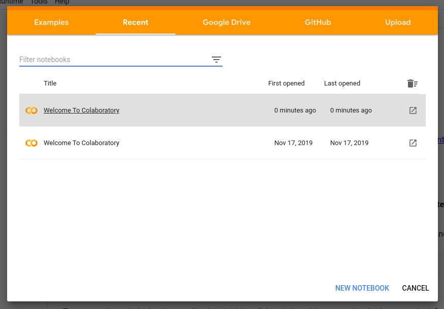
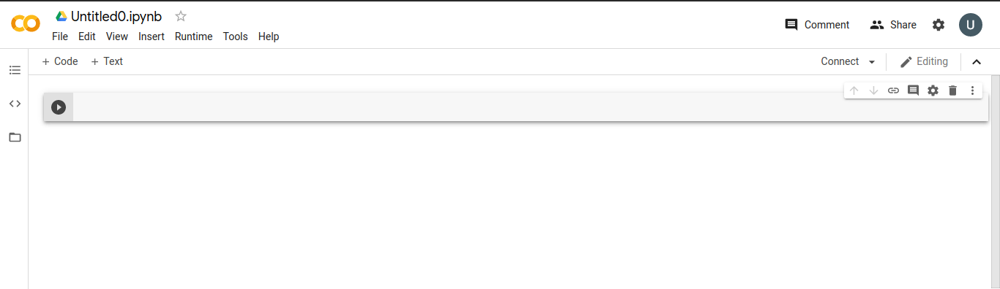
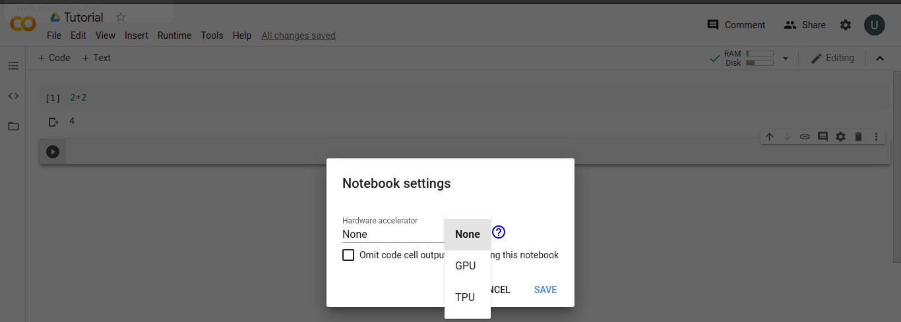
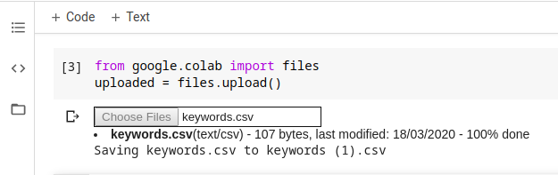
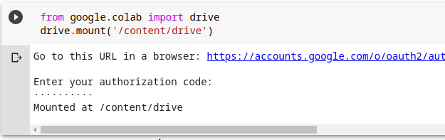
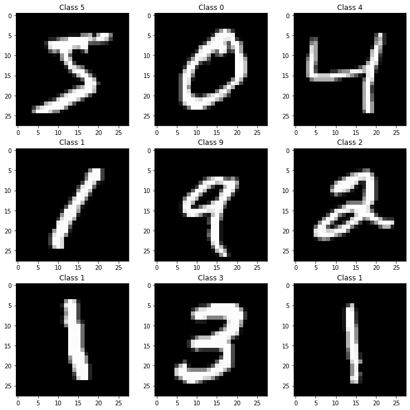
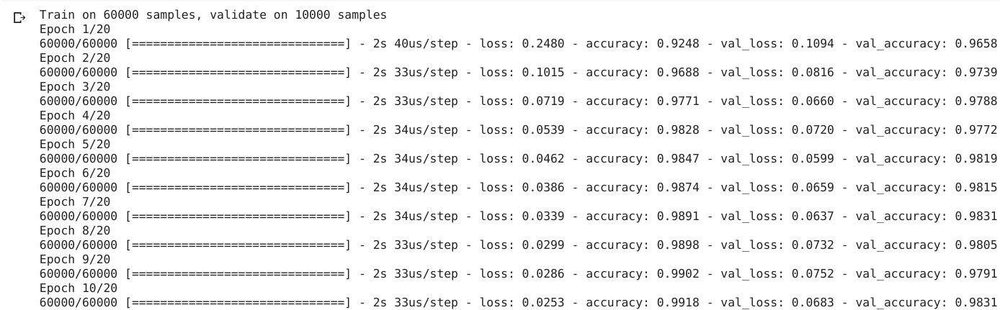
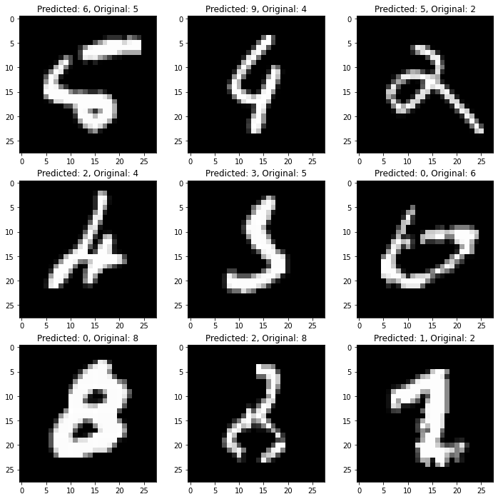
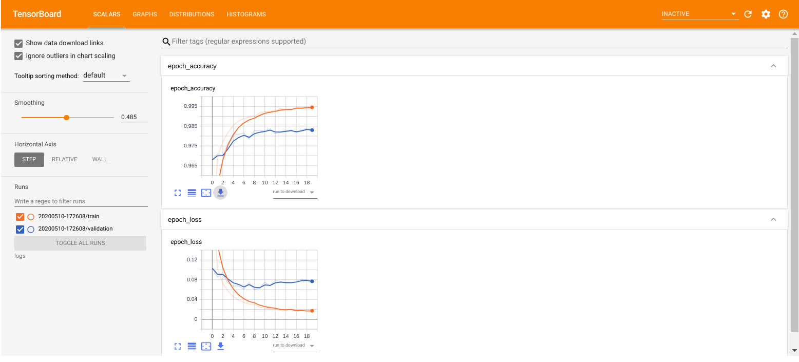
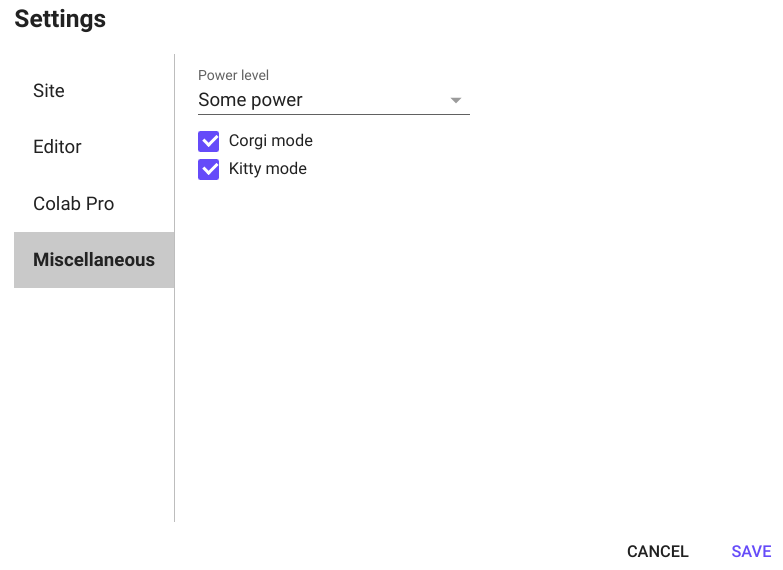

# Tutorial on training deep learning models on Google Colab

## Introduction

Have you ever been stuck in training a deep learning model due to insufficient computational resources of your machine maybe without GPUs or financial incapability to buy a high configuration machine? If yes - this tutorial is for you!

[Google Colaboratory](https://colab.research.google.com/) is a service from Google that offers you GPUs and TPUs (Tensor Processing Unit) to train your model for free! You can have multiple instances of CPU, GPU, and TPU simultaneously, however, the only restriction is that you can run them for a continuous period of 12 hours. This is more than enough for most of the day-to-day deep learning tasks. After 12 hours, the machine is cleared. You can again request for resources and have them as there is no restriction on the number of request you can make. Apart from that, everything is already in configured in Colab, therefore you don't have to install any library or package to get started. It also facilitates in-built version control and easy sharing of the code. 

## Getting Started

As mentioned earlier, getting started with Colab is super easy. You do not need to do any sign up, your existing google account is sufficient. Colab editor is very similar to Jupyter Notebook and offers almost the same features. For creating a Colab notebook, go to [Google Colaboratory](https://colab.research.google.com/) and click _NEW NOTEBOOK_ as shown in the following figure. The notebook itself and the changes are stored in your Google Drive. You can create a folder for notebooks, by default those are stored in  a folder named _Colab Notebooks_. It is also possible to create notebook from your drive.  



A new Colab notebook looks like the image below. To rename the notebook simply click on _untitled.ipynb_ at the top left corner of the page, type your preferred name for the notebook and hit _ENTER_.



In order to collaboratively work on a notebook you can invite collaborators by clicking the share button at the top right of the notebook. Type the email of your collaborator and make sure that the role is set to editor as shown below.


By default Colab notebooks run on CPUs but for heavy computation you may need to use GPU and TPU. To change the default, click on _Runtime_ and then _Change runtime type_; next select GPU or TPU in the runtime and save.



To run codes in the cell you can click the play button on the left of the cell or _CTRL + ENTER_. If you want to get a new cell after running current cell, hit _SHIFT + ENTER_.

## Import, install and check version of libraries

Common python libraries along with data science libraries such as Keras, TensorFlow, PyTorch, and OpenCV are available by default in the Colab and you can import them as usual. For example, to import Pandas, Numpy and Matplotlib libraries write the code below in a cell and run.
```python
import pandas as pd
import numpy as np
import matplotlib.pyplot as plt
```
However, sometimes we need to install libraries which are not available by default but required for a project. We can import them with the syntax ```!apt-get -qq install -y LIBRARY-NAME``` or ```!pip install -q LIBRARY-NAME ```. In order to check the version of an available library we use ```!pip show LIBRARY-NAME```.

#### Q1. Install _graphviz_ and _pydot_ library not in google Colab by default. What syntax worked for each library? Try to install any other library. Give screen shots of the successful install and version in your response. 

## Importing dataset

There are numerous ways to ingest data into a Colab notebook. Let us try to import some dataset from different sources.
 
 **From local machine**
 
 There are two steps of this method. First upload the file by the code snippet below. Click on **Choose Files**, select files to be uploaded and wait for them to be uploaded 100% as shown in the image below.
 
 ```python
 from google.colab import files
uploaded = files.upload()
 ```


A list of all uploaded files can be viewed by clicking the folder icon on the left panel. Now we can ingest the data into pandas dataframe with the code below assuming you uploaded a CSV file.

```python
import io
import pandas as pd
df = pd.read_csv(io.BytesIO(uploaded['FILE-NAME.csv'])) # Replace FILE-NAME with your files name
```
 
 **From google drive**
 
 With the inter-connectivity of all google services, it is convenient to fetch data from google drive to Colab notebooks. To access the files in your drive from Colab notebooks, you have to authorize the permission to access drive. To do so, run the following code.
 
 ```python
 from google.colab import drive
 drive.mount('/content/drive')
 ```
 This will give you an url, click on the url and authorize your drive account. After authorization, copy the code and paste it in the notebook and hit _ENTER_. If the authorization is successful, a message like the following figure will be shown. 
 
 
 
 Now you can access your drive with the path ```'/content/drive/My Drive/'``` and hence ingest file by giving the path like this ```'/content/drive/My Drive/'FILE-NAME'```. 
 
 **From link to external source**
 
 Sometimes we have data hosted externally in repositories on github or maybe an s3 bucket. To access data on github simply use the url of the raw view. 
 
 ```python
 url = 'RAW_GITHUB_DATA_LINK'
df = pd.read_csv(url)
 ```

For accessing data from an s3 bucket, we can use the _s3fs_ library. The syntax is as follows:
```python
import pandas as pd
import s3fs

df = pd.read_csv('s3://BUCKET-NAME/FILE-NAME')
```
 
#### Q2. Try the three methods for uploading data to Colab. Add screenshots to the response file.

## Training your first deep learning model

Though this tutorial is not concerned about Artificial Neural Networks (ANN), just to keep the readers in context, we give a brief introduction of them. As the name implies, ANN is a learning algorithm that mimics the working of human brain. It can learn complex functions from the dataset provided called the training dataset and can estimate the output of the function for the unknown dataset termed as the test dataset. Following figure from the [Convolutional Neural Networks for Visual Recognition](https://cs231n.github.io/) course of Stanford University shows the structure of a basic neural network.

  

The network is build by strongly connecting the neurons i.e., the nodes by edges. Basically, each of the node sum all the values calculated by multiplying input values with the weights of the corresponding edges incident on it. It then apples an _activation function_ and send the result to the next layer. However, with the advances of technology, many complex concepts are introduced and adopted with the base architecture. Deep learning is a subclass of machine learning algorithms based on ANNs. When we are talking about deep neural networks, they usually have much more hidden layers than an ordinary ANN which also makes them computationally expensive. Deep learning has lot of application in computer vision, forecasting, natural language processing, and many other domains of AI.

Now it is perfect time to train and test our first deep learning model. We will use [MNIST dataset](http://yann.lecun.com/exdb/mnist/) for this purpose. The dataset contains 70K 28X28 pixel grayscale images of handwritten digits between 0 to 9. For creating our model, we will use [Keras](https://keras.io/) library. Keras is one of the most popular open-source neural-network libraries written in Python. It has extensive documentation and facilitates fast creation of deep neural networks in a extensible and modular way. 

First we import the necessary libraries and the dataset. The MNIST dataset is available by default in Keras. 

```python
import numpy as np #library for array computation
import matplotlib.pyplot as plt #library for visualization
plt.rcParams['figure.figsize'] = (12,12) #increase the size of the figure to fit all subpolots

from keras.datasets import mnist #the dataset is available by default
from keras.models import Sequential #class for creating the neural net model
from keras.layers.core import Dense, Dropout, Activation #classes of building bolcks of neural network
```
Now let's do some exploration of the dataset. First we want to know how the dataset looks like. Following code splits the dataset into train and test set and prints their dimensions.

```python
(X_train, y_train), (X_test, y_test) = mnist.load_data()
print("Shape of training set: ", X_train.shape)
print("Training lables: ", y_train)
print("Shape of the test set: ", X_test.shape)
print("Test set labels: ", y_test)
``` 
As we can see, the train set contains 60000 images and the test set contains 1000 images and the labels of both train and test set are a list of the numbers that is contained in the corresponding images. As the dataset contains images, it will be better to visualize the images. 

```python
for index in range(9):
    plt.subplot(3,3,index+1)
    plt.imshow(X_train[index], cmap='gray')
    plt.title("Class {}".format(y_train[index]))
```
Running the above code shows the first 9 images of the training set and their class labels. 

 

Now we have better understanding of our dataset. Let's prepare them to feed into our model. Each of the images is represented as a matrix of 28X28 size. To feed them into the input layer of the neural net, we flatten them as a linear array of 784 elements using the _reshape_ function. Each element represents a color intensity values between 0 to 255. This variation of the intensities with adversely affect the accuracy of the model. To solve this we need to normalize the intensity values. The simplest form of normalization is to divide all the values by the highest value. We set the type of the values as _float32_ so that automatic type casting of Python does not make them either zero or one. Finally, We convert the class labels to a list of 10 binary variables as we have 10 classes. 

```python
X_train = X_train.reshape(60000, 784)
X_test = X_test.reshape(10000, 784)
X_train = X_train.astype('float32')
X_test = X_test.astype('float32')
X_train /= 255
X_test /= 255
Y_train = keras.utils.to_categorical(y_train, 10)
Y_test = keras.utils.to_categorical(y_test, 10)
```
 #### Q3: At this step, verify the dimensions of the train set, test set, and corresponding class labels by printing them. Take a screenshot of the result and add it in your response. How the converted class labels of list of binary variables makes sense to you?  
 
 As we have prepared our dataset for training, next step is to create the model. We use a simple model so that it does not take too much time in training and the time required to follow this tutorial remains reasonable. It contains only three layers, one input and one hidden and one output layers. We pass the number of neurons in each layer to the _Dense()_ call. The Rectified Linear Unit (ReLU) activation function is used for the first two layers because it is easier to compute and gives better performance. To get the output as class labels, we define _softmax_ activation function for the final layer. Overfitting is a undesirable situation in model training where the network overfits the training dataset and so it gives worse performance for the unknown test dataset. To help avoiding the overfitting problem, we add a dropout layer after activation. Finally, we define the loss function, optimizer and performance metrics of the model and compile it. These parameters guide the training process and helps the model to be better and better as the training proceeds.   
 
 ```python
#define some parameters for the model
number_of_classes = 10 
number_of_epoch = 20
size_of_batch = 128

#create the model 
model = Sequential()
model.add(Dense(512, input_shape=(784,)))
model.add(Activation('relu'))
model.add(Dropout(0.2))
model.add(Dense(512))
model.add(Activation('relu'))
model.add(Dropout(0.2))
model.add(Dense(10))
model.add(Activation('softmax'))
            
model.compile(loss='categorical_crossentropy', optimizer='adam', metrics=['accuracy'])
```  
It is intuitive that, we can devise more deeper networks by adding more layers in the network. A simple network like this can not perform well on a complex visual recognition task. Large number of layers enable network to learn complex functions which are required for advanced visual recognitions and operations. We can start training our network by running the following command. 

```python
model.fit(X_train, Y_train,
          batch_size=size_of_batch, epochs=number_of_epoch,
          verbose=1,
          validation_data=(X_test, Y_test))
```

As the _verbose_ is enabled, the training progress will be shown as the following figure. For each of the epochs, the training and validation loss and accuracy are displayed. This helps to decide how well the training is going and also detect overfitting.
  
  
  
If the training process is taking too much time, please make sure you are using a GPU in the runtime setting. After the end of training, the model is ready to be evaluated. The following code snippet evaluates the model on the test set and displays the accuracy. 

```python
score = model.evaluate(X_test, Y_test, verbose=0)
print('Test accuracy:', score[1])
```
#### Q4: How much accuracy have you got? Is it satisfactory to you? If not, what could be done as a step to improve the accuracy? 

It will be easier to understand the model by displaying some images on which the model success and fails rather than just a number. Therefore, we get the class labels predicted by the model for the test images and then compare it with the original class label and plot some samples. 

```python
predicted_classes = model.predict_classes(X_test)
correct_predictions = np.nonzero(predicted_classes == y_test)[0]
incorrect_predictions = np.nonzero(predicted_classes != y_test)[0]

plt.figure()
for index, correct_prediction in enumerate(correct_predictions[:9]):
    plt.subplot(3,3,index+1)
    plt.imshow(X_test[correct_prediction].reshape(28,28), cmap='gray')
    plt.title("Predicted: {}, Original: {}".format(predicted_classes[correct_prediction], y_test[correct_prediction]))
    
plt.figure()
for index, incorrect_prediction in enumerate(incorrect_predictions[:9]):
    plt.subplot(3,3,index+1)
    plt.imshow(X_test[incorrect_prediction].reshape(28,28), cmap='gray')
    plt.title("Predicted: {}, Original: {}".format(predicted_classes[incorrect_prediction], y_test[incorrect_prediction]))
```
Let us have a look on some samples which are predicted successfully. 


Following figure shows some samples on which model fails to give correct predictions. 
 



## Integrating TensorBoard to visualizing training profile

[TensorBoard](https://www.tensorflow.org/tensorboard) is a entirely offline suite of web applications for inspecting and understanding your machine learning model creation. Previously, we showed the training profiles through plain text verbose. This representation is not much helpful to understand the whole training process. Moreover, model creation is trial and error process. Usually we need to try with different parameter settings and compare the models. In such cases, TensorBoard comes into play. To configure the TensorBoard, substitute the previous training code block (_model.fit()_) with the following code block.
```python
%load_ext tensorboard
import datetime, os
from keras.callbacks import TensorBoard
logdir = os.path.join("logs", datetime.datetime.now().strftime("%Y%m%d-%H%M%S"))
tensorboard_callback = TensorBoard(logdir, histogram_freq=1)

model.fit(X_train, Y_train,
          batch_size=size_of_batch, epochs=number_of_epoch,
          verbose=1,
          validation_data=(X_test, Y_test), 
          callbacks=[tensorboard_callback])
%tensorboard --logdir logs
```  
The following TensorBoard dashboard shows how the loss decreases and accuracy increases with epochs. It also has some more complex visualization options to better understand your model creation.




#### Q5: Add a screenshot of the TensorBoard dashboard showing your training profiles.  

## Tips and shortcuts

To increase your productivity in using Colab, in this concluding section we provide some useful tips and shortcuts.

**Running terminal commands:** You can run the terminal commands in the notebook cell by just adding '!' sign in the beginning of the command like this: _!pwd_. Therefore, you can _git clone_ the repositories as you can do in terminal. 

**Checking environment information:** You can get the details of the CPU of your environment by running the command _!cat /proc/cpuinfo_ and for RAM it is _!cat /proc/meminfo_. To get the GPU information, you have to run the following code. 

```python
import tensorflow as tf
tf.test.gpu_device_name()
```
**Checking function documentation:** During coding we frequently need to check the documentation of library functions. For that, you just have to add a '?' at the end of function name, then Colab will show the documentation of the function.  

**No backend with GPU available:** You may rarely get this error when trying to use GPU. This means no GPU is available to be provisioned. In this case you have to try again later.

**Colab Pro:** If you want to increase your continuous usage time from 12 hours to 24 hours and get priority access to faster GPUs and high memory (default is 13GB) environments, you can upgrade your account to Colab Pro by paying $9.99/month.    

## Optional activity
How about having some fun when you go through the complex model creation process? Go to _Settings_ from to right corner and then _Miscellaneous_ option. Enable one or both options as shown below and see the magic! 



### Happy Coding!
