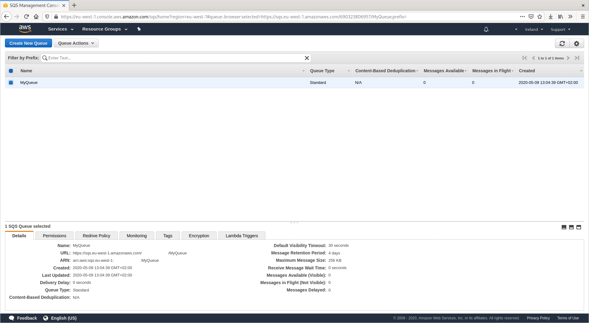
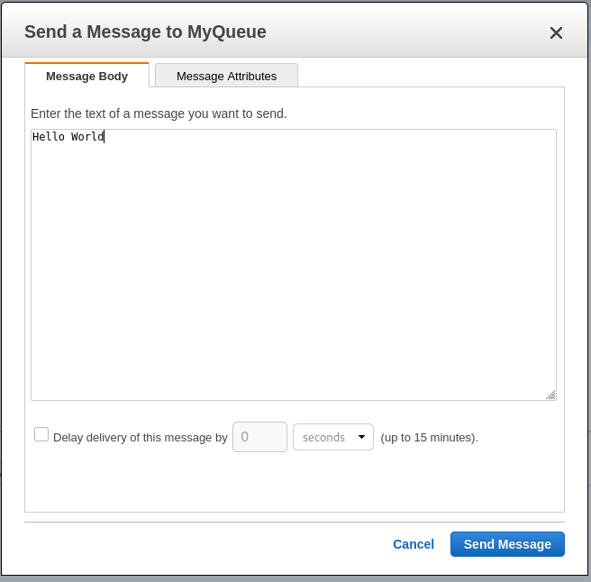
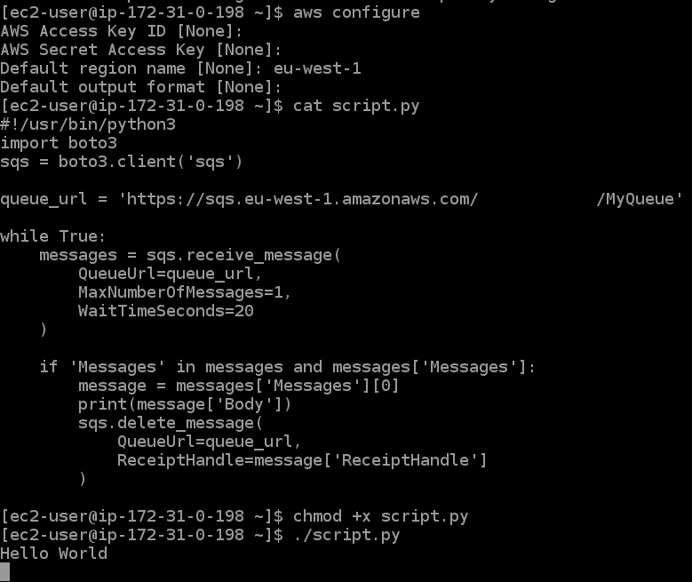
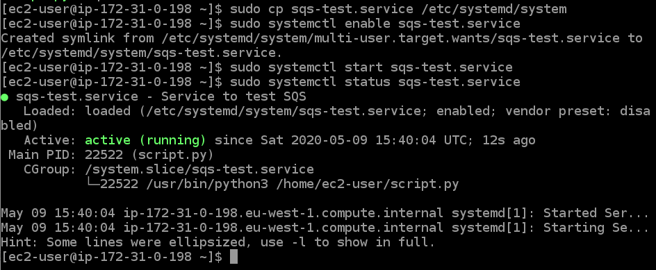
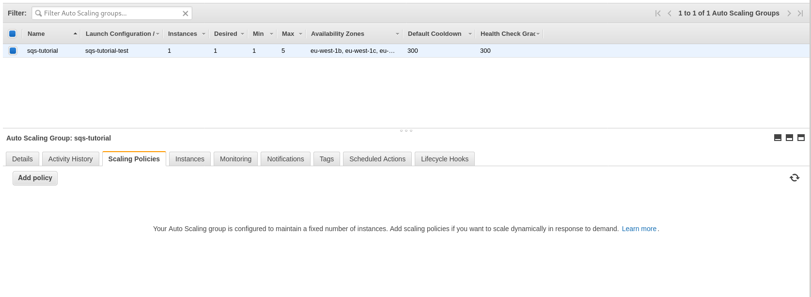
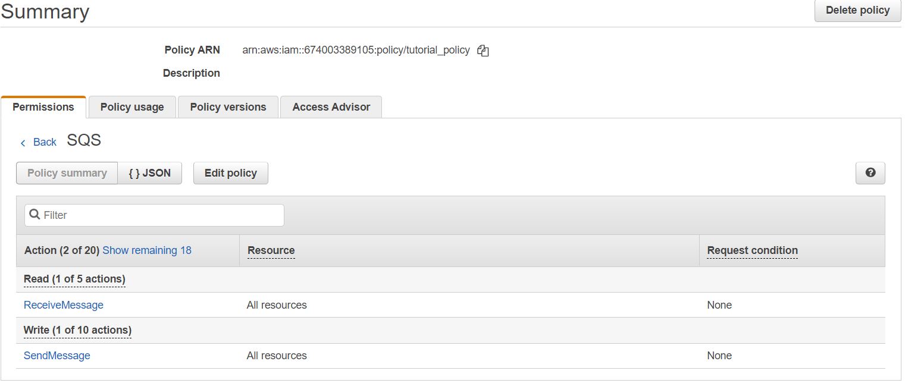
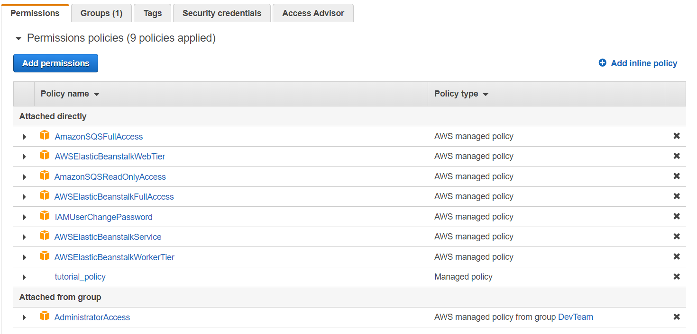
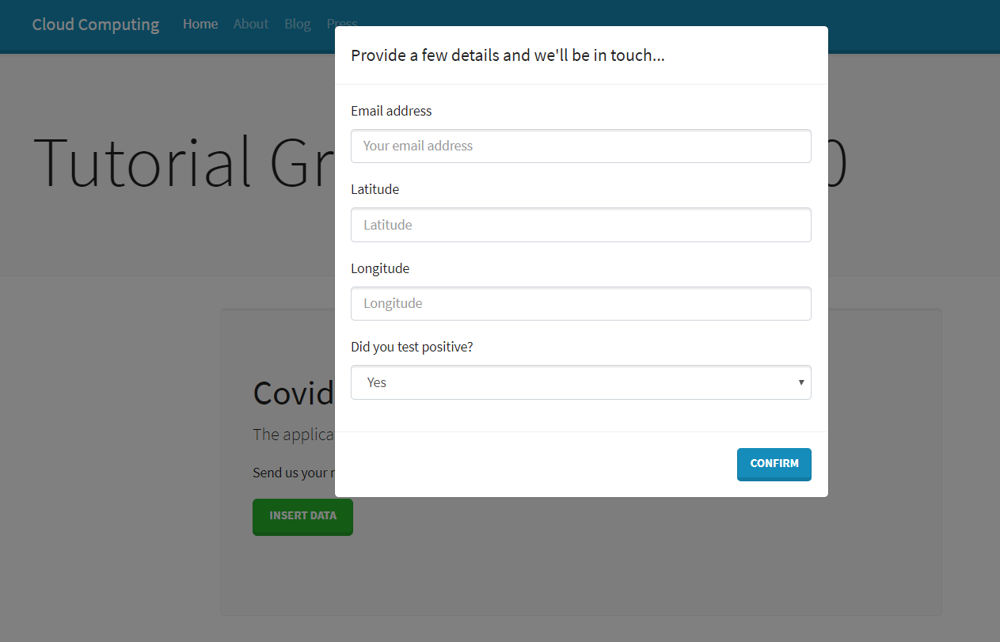
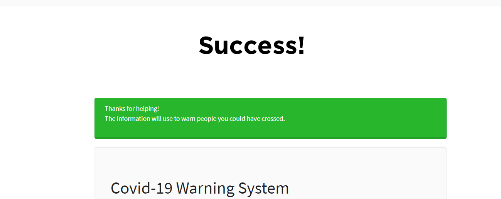

# TUTORIAL: Implement Amazon Simple Queue Service (SQS) to execute escalable processes according to demand

__Amazon Simple Queue Service (SQS)__ is a secure and available queue message service which provides integration and scalability of “serverless” microservices, distributed systems and applications. SQS gets in charge of the complexities in the management and functionalities of the middleware so that developers can develop applications more efficiently. SQS allows to send, store and receive messages through two types of queue messages. On the one hand, the standar queues offers efficient processing; on the other hand, the FIFO queues guarantee a unique execution of the messages in order.
Moreover, SQS implements an API service to get access from any programming language which supports the SDK of AWS. In the case of this tutorial, __Python (boto3)__ has the necessary libraries to operate SQS services without any problem.

In the following architecture, the autoscaling group is used to manage the different EC2 instances according to the requests from the queue. In Amazon CloudWatch, we are going to measure the number of requests from the queue so that the AutoScaling group can launch or terminate instances based on demand and also set parameters of configuration as time of execution, delay and others. For more information, you can access the [documentation](https://docs.aws.amazon.com/autoscaling/ec2/userguide/as-using-sqs-queue.html#scale-sqs-queue-custom-metric)


Benefits and Features
- Dynamic creation of SQS queues and automatic autoscale
- Freed management of services and additional software
- Data protection while interchanging information among applications
- Successful message transference guaranteed regardless the data volume or the processing.
- Scalability according to demand of message requests

# Hands-On: The tutorial starts

In this tutorial, we are going to learn how to create a SQS queue, a consumer to measure the requests, an autoscaling group to process the requests on demand and how to connect our web application to the queue. With these insights, you are going to be able to create a deeper solution that we will propose:

* [Task 1.1: Creating an SQS queue](#Tasks11)
* [Task 1.2: Creating a consumer for your queue](#Tasks12)  
* [Task 1.3: An autoscaling group for your consumers](#Tasks13)  
* [Task 1.4: Other improvements in the architecture](#Tasks14)
* [Task 1.5: Create a AWS Beanstalk web app to send requests to SQS](#Tasks15)
* [Task 1.6: Your development - Getting ready for the next step](#Tasks16)

<a name="Tasks11"/>

## Task 1.1: Creating an SQS queue

To get started, go to https://aws.amazon.com/sqs/features to learn more about SQS queues if you’re unfamiliar. We will be using standard queues throughout this tutorial.

### Create a queue

Access SQS through your AWS console. If you don’t have any created queues you will be met with a landing page. Click on Get Started Now to create an SQS queue, or on Create New Queue if you already have other queues. We will be using a standard queue, name it something you will remember like “MyQueue”. Leave the default parameters.



### Test sending/receiving messages

Now you can test sending and receiving messages from the queue. Under Queue Actions you will find the Send a Message and View/Delete Messages items. __Experiment with them by sending messages to the queue, viewing them and deleting them__. Note that messages stay in queue until you explicitly delete them, and that messages you’re viewing aren’t visible by anyone else until you stop viewing them.

<a name="Tasks12"/>

## Task 1.2: Creating a consumer for your queue

Next we will create a process to automatically consume messages from the queue.

### Launch an EC2 instance

Firstly, you need to launch an EC2 instance. The exact details are out of the scope of this tutorial. While the following steps could be done in any regular physical machine, an EC2 instance will be used as base for the next sections of the tutorial. Take care to assign the correct IAM role to the EC2 instance such that it can interact with SQS and ensure you’re using the latest Amazon Linux AMI. Note that you might have to install some packages, like python3.

### Periodically fetch messages

Next we will interact with the queue programmatically. You’re welcome to investigate by yourself how to do so in your language of preference, what follows is a simple python script that retrieves messages from the queue as they are received. You will have to retrieve the queue’s URL, from the AWS console for example.

```python
#!/usr/bin/python3 -u
import boto3
sqs = boto3.client('sqs')

queue_url = 'https://sqs.eu-west-1.amazonaws.com/690323806957/MyQueue'

while True:
	messages = sqs.receive_message(
    	QueueUrl=queue_url,
    	MaxNumberOfMessages=1,
    	WaitTimeSeconds=20
	)

	if 'Messages' in messages and messages['Messages']:
    	message = messages['Messages'][0]
    	print(message['Body'])
    	sqs.delete_message(
        	QueueUrl=queue_url,
        	ReceiptHandle=message['ReceiptHandle']
    	)

```

The WaitTimeSeconds parameter is optional. In order to use it you would have to change the queue’s configuration to allow for its use. This value means that SQS will spend this amount of seconds retrieving new messages and only stop after they have passed or after it has found MaxNumberOfMessages messages. It’s recommended to use this maximum value of 20 seconds whenever possible, to avoid receiving many empty responses. However this means that the call to the receive_messages function can take up to 20 seconds to complete.

__Check that you can send a message to the queue via the web console interface and that the message is successfully retrieved by the script.__





### Start automatically with instance

It would be interesting to have your script run automatically with the EC2 instance, and even more interesting if it would be automatically restarted if it crashes. For this we can use systemd.

“systemd is a software suite that provides an array of system components for Linux operating systems. Its main aim is to unify service configuration and behavior across Linux distributions.” (From Wikipedia)
All components that run in the background of the EC2 instance, like the sshd daemon that allows ssh connections, are running under systemd. Our consumer will be another of these components.
We need to add a description of this new “service” to a directory, then issue a command to enable this service on startup, and another to start it now. Systemd will take care of the rest. Create a new file with the name __sqs-test.service__ and with the following contents:

```
[Unit]
Description=Service to test SQS
After=syslog.target network.target

[Service]
Type=simple
User=ec2-user
Group=ec2-user
WorkingDirectory=/home/ec2-user
ExecStart=/home/ec2-user/script.py
StandardOutput=syslog
StandardError=syslog
Restart=on-failure

[Install]
WantedBy=multi-user.target
```

Take care that the WorkingDirectory and ExecStart lines point to the working directory your script expects, and to the script itself. The script should have execute permissions (chmod +x script.py) and the appropriate [shebang](https://en.wikipedia.org/wiki/Shebang_(Unix)). Copy this file to /etc/systemd/system. To enable and start the service use:

```
sudo systemd enable sqs-test.service
sudo systemd start sqs-test.service
```

Note that despite using sudo, the script will run as the unprivileged user ec2-user (reducing the attack surface if your app is somehow compromised) and will be restarted on failure (but not if it exits cleanly). For more information on systemd unit files you can check the [documentation](https://www.freedesktop.org/software/systemd/man/systemd.unit.html).

__Verify that the script is running by issuing the following command:__

```
systemctl status sqs-test.service
```



You can still see the printed messages from your script in the system log. To view it use:

```
journalctl
```

This will show you the whole. The script’s output will be mixed with other services and the kernel’s own messages. To restrict it to our service you can add the option “-u sqs-test.service” and if you want to limit it to the current boot use ‘-b’. With the ‘-f’ flag, it will show new output as it is produced.

```
journalctl -u sqs-test.service -b -f
```


__Using the above command, check that the script’s output can be seen. Also check that the script stops and restarts on reboot without any user intervention.__


<a name="Tasks13"/>

## Task 1.3: An autoscaling group for your consumers

Now that we have a single EC2 instance consuming messages from the queue, we might want to scale automatically. If each message takes us a certain time to process and we receive many messages, we might end up receiving more messages than we can process with one single consumer. We can use an autoscaling group that will scale automatically when it detects we have too much of a backlog of messages in the queue.

### Create an autoscaling group

Create an autoscaling group based on the previously created EC2 instance. How to create it exactly is left up to the reader. It’s suggested to create a [Launch Template](https://docs.aws.amazon.com/AWSEC2/latest/UserGuide/ec2-launch-templates.html) with a user data script that automatically sets up the environment from the previous steps, creating all the files and enabling/starting the service. Finally base the autoscaling group on this launch template.

After this, we will have an autoscaling group but it won’t be configured to use any metric to scale. The following step creates a way to monitor our current backlog of messages per consumer.



### Create an instance for monitoring

We will need a new EC2 instance for monitoring the status of the autoscaling group and the queue. This instance will programatically retrieve the number of currently running instances in our scaling group, the approximate number of messages in the SQS queue, perform the division and send the result to CloudWatch as a metric.

A tutorial on how to do this using command line tools can be found under Step 1 in the following [link](https://docs.aws.amazon.com/autoscaling/ec2/userguide/as-using-sqs-queue.html). 

The previous mechanism using a systemd service could be used to ensure this process keeps running. However one could also chose to use systemd timers or the simpler cron interface. Or any other mechanism. The final monitoring solution should be sending CloudWatch updated data roughly every minute.

### Autoscaling based on cloudwatch metric

This is the second (and third) step of the tutorial found in the previous link. At this point there should be a metric in [CloudWatch](https://aws.amazon.com/es/cloudwatch/) that knows what the current backlog per consumer of your SQS queue is. Now we will update our autoscaling group to scale based on this metric. It will try to keep it at a certain value, adding more consumers when it gets higher, and removing consumers when it gets lower. The second step of the tutorial shows how to tell autoscaling to use this metric to scale. And the third is just for testing.

Any key point is knowing what value you should configure the autoscaling with. The tutorial link also talks about this. It’s not an exact science, however, and experimenting with the best value depending on your workload might be the best answer.

#### Optional Task: Edit the python script such that processing a message will take some time. Then create the autoscaling group. Issue many consecutive messages to the queue and check that the autoscaling group scales out to accommodate the new workload, and then scales out as the workload lessens.


<a name="Tasks14"/>

## Task 1.4: Other improvements in the architecture

The following improvements could be added on top of everything that has already been done. Some might require a significant change to the architecture of what has been done so far, but it would be nice to implement at least one of them.

### Invisibility timeout

As you may have noted at the start of this tutorial, while dealing with a message in a queue, the message becomes “invisible” to any other consumers. This timeout is useful to deal with failing processes. If a process crashes after retrieving a message from the queue but before it can fully process it, the message will return to the queue after this timeout and another consumer can process it. After a process is done processing a message it deletes it so that it’s no longer available to any other consumers even after the timeout has expired.

However an imporant thing to consider is what should be the value of this timeout. By default SQS sets it to be 30 seconds, but depending on the exact work being performed this might be too much or too little. It’s also possible to extend this timeout, in case you don’t know how much your application will take. You can keep extending it until it finalizes.

#### Optional Task: Try to implement a similar mechanism that keeps extending the visibility timeout of the message while its being processed by your application.

### Dead letter queue

Sometimes problematic messages can end up in the queue. For example, a message that crashes any consumer that tries to process it. These messages would stay forever in the queue, constantly being received but never deleted. SQS has a mechanism to deal with them: A redrive policy using a dead letter queue.

When a message has either spent more than a configurable amount of time (default 4 days) in the queue or it has been received but not deleted more than a configurable number of times, the message is sent to the dead letter queue. If no dead letter queue is configured, a message will be automatically permanently deleted after these (default) 4 days. Note, however, that message age is preserved, and so a 4 day old message that is deleted because of age will also be 4 days old when it enters the dead letter queue and might be immediately deleted from it as well, if the default is not changed.

#### Create a dead letter queue for your own queue. Configure it such that old messages or messages that have been retried too many times end up in it. And set up either SNS or Lambda such that you can be notified somehow of messages that end up in the dead letter queue.

### Dealing with duplicated messages

Several parts of the SQS documentation state that standard queues guarantee “at least once delivery”. This means messages might be delivered more than once. This is not a problem is the tasks you do with your queue are idempotent, e.g. doing the exact same thing more than once produces no different results than doing it exactly once. However, if that is not the case you can use either FIFO queues or implement some sort of mechanism to detect and prevent duplicates. Using a database like DynamoDB, implement a mechanism to check if a message has already been received by your queue.


<a name="Tasks15"/>

## Task 1.5: Create a AWS Beanstalk web app to send requests to SQS

In this step, we will deploy an AWS Beanstalk environment to host a web application which will ask for contact information, location and health status in order to update the database and warn possible infected people. The information will be sent to the SQS queue which will launch a new instance in the auto scaling group in order to process each request. Some of the steps required, we have already developed during the lab:

### Create IAM Policy, Role and User to send requests to SQS

First of all, we are going to create the required permissions to run the application and connect to the SQS queue.

Create a policy called tutorial_policy with the following permissions: 

1. Service: __SQS__
2. Actions: Allow __ReceiveMessage__ and __SendMessage__



Create IAM role called tutorial_role:

1. Service: EC2
2. Attach __tutorial_policy__, __AWSElasticBeanstalkWebTier__

Create user “Your name”:

1. Check "Programmatic access" as Access type.
2. Attach existing policies directly: __tutorial_policy__, __AWSElasticBeanstalkFullAccess__ and __AmazonSQSFullAccess__.



As a result, you will get an Access key ID and secret key which will allow you to deploy an EC2 web app and send the request to the SQS queue.

### Deploy a web application in Elastic Beanstalk using the aws command 

In this step, we are going to deploy a web app so that it can gather the main parameters of the customer and send the request to the SQS. For this purpose we can install the packages of AWS CLI in our Python command line. This task has already been developed during the past lab sections. The source code is in the [tutorial_source](https://github.com/CCBDA-UPC/2020_Project_Tue_9_00/tree/master/research/tutorial_source) folder

Firstly, we are going to set the current directory to the [tutorial_source](https://github.com/CCBDA-UPC/2020_Project_Tue_9_00/tree/master/research/tutorial_source) folder in the Python command line. Next, we are going to initiate an instance of Elastic Beanstalk environment and select the required options according to the previous labs. In order to run the codes provided, you must select Python 3.6 as the platform version.

```
eb init
```

The following step is to create the necessary resources to run the application. We also require to specify the __SQS_QUEUE_URL__ from the previous steps as well as the access id and key from the user who has the permissions to use SQS and Elastic Beanstalk instance

```
eb create --service-role aws-elasticbeanstalk-service-role  --elb-type classic --vpc.elbsubnets eu-west-1a --envvars DEBUG=True,SQS_QUEUE_URL=<YOURS>,AWS_REGION=eu-west-1,AWS_ACCESS_KEY_ID=<YOURS>,AWS_SECRET_ACCESS_KEY=<YOURS>
```

You can go to the Elastic Beanstalk console and validate if your application server has been deployed. The web page should be like this after clicking in insert data:




A successful execution should give the following message (at this point, you have sent a message sent to the queue):




### Send a message to SQS with customer information

Since we want to send messages to the queue, we need an API which can ease the process. Fortunately, the python library boto3 provides a client of sqs which can be in charge of this process.

```python
sqs = boto3.client('sqs')
```

When the user press in the button “confirm”, a POST request is going to be activated calling the function insert_lead with the parameters of infection and contact that the user filled. The function will initialize a sqs client and then send the message to the sqs with the client function __sqs.send_message()__. This function takes as parameters:

- URL of the SQS queue which has been defined as an environmental variable
- DelaySeconds: period of time to delay a specific message. It doesn’t apply to FIFO queues
- MessageAttributes: all the parameters that the executing function need to process. Each attribute has a <key, value> format in which you have to specify the name of the attribute, the data type and the value.
- MessageBody: A message to send no more than 256KB

```python
response = sqs.send_message(
                QueueUrl=SQS_QUEUE_URL,
                DelaySeconds=10,
                MessageAttributes={
                    'email': {
                            'DataType': 'String',
                            'StringValue': email
                            },
                    'latitude': {
                            'DataType': 'String',
                            'StringValue': latitude
                            } ,
                    'longitude': {
                            'DataType': 'String',
                            'StringValue': longitude
                            } ,
                    'infectedFlag': {
                            'DataType': 'String',
                            'StringValue': infectedFlag
                            } 
                },
                MessageBody=(
                    'individuals database to warn possible infected people'
                )
            )

```

You can look for more information about the sqs client in the following [link](https://boto3.amazonaws.com/v1/documentation/api/latest/guide/sqs-example-sending-receiving-msgs.html)

After updating the source code, you can deploy one more time your application with the following command:

```
eb deploy
```

<a name="Tasks16"/>

## Task 1.6: Your development - Getting ready for the next step

In the next step we will use our consumers to consume messages from an AWS Beanstalk application. Read the next section and make the changes to the consumer script you deem necessary. Note that if you change the launch template you’ll need to terminate every instance on your scaling group so new ones are created with the new version of the code.

#### 1. Update the python script so that it extracts the form data from the SQS queue message and updates a database table (for example DynamoDB) with the information. Then check that this is done correctly and attach the results and code to the repo.

- [DynamoDB Help](https://github.com/CCBDA-UPC/Assignments-2020/blob/master/Lab04.md)
- [DynamoDB Operation in Python](https://docs.aws.amazon.com/amazondynamodb/latest/developerguide/GettingStarted.Python.html)

#### 2. Create a queue to send a mail to people probably infected (people who shared the same location with infected people (infectedFlag = Yes). Check if you receive the mail and attach the code and images to your repo.

- [Simple Email Service](https://docs.aws.amazon.com/es_es/ses/latest/DeveloperGuide/send-using-sdk-python.html)


## We hope you enjoyed and learned with this Tutorial!!
