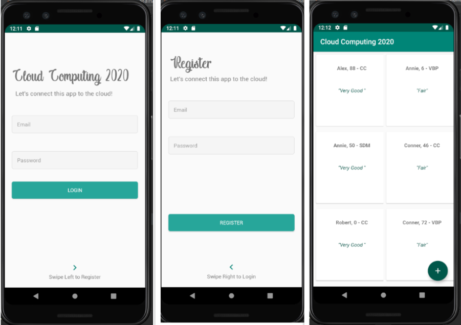
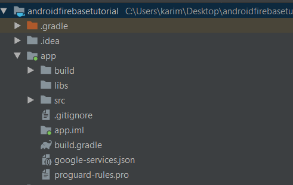
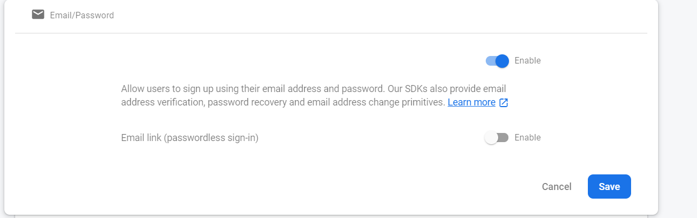
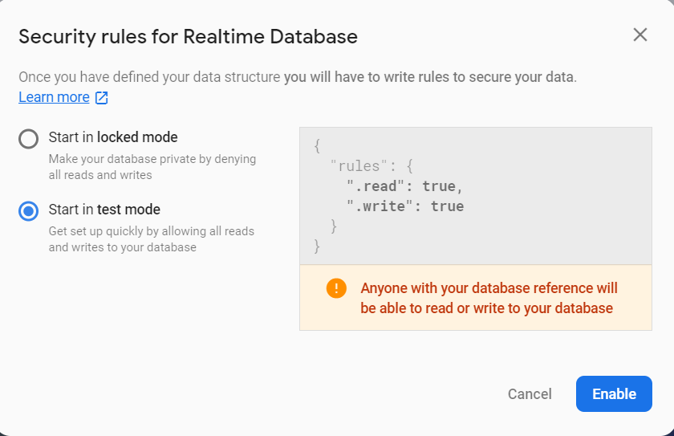
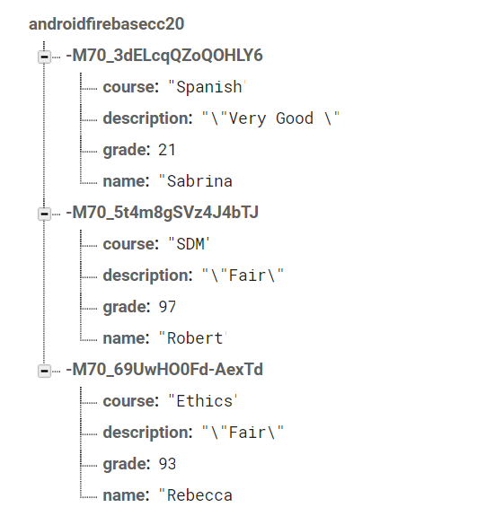

# Connecting Android Application to Firebase 

In this tutorial, we will create a simple android app on andriod studio and connect it with Firebase. This aims to explore Firbase authentication, realtime database,  and subscribe to realtime updates. 
* [Task 1: Download the androidfirebasetutorial project, load it in Android Studio, and test it](#Tasks1)
* [Task 2: Create Firebase Project to link Firebase to your Android App](#Tasks2)  
* [Task 3: Authenticating Sign-in and Registration screens through Firebase](#Tasks3)
* [Task 4: Create a Firebase Realtime Database to have realtime Updates on your Android Application ](#Tasks4)  


### Prerequisites : 
### Downloading android studio
Android Studio is an official IDE from Google to develop android applications. In addition, it includes emulators used for testing and debugging newly developed apps. \
\
In order to create an app, we need first to download and configure android studio. use this link https://developer.android.com/studio to download on Mac or Windows. 

### Creating Firebase account
Firebase is an application developement platform from Google. In this tutorial, we will use Firebase to authenticate our developed application and use Firebase's Realtime Database, meaning data syncs automaticaly as fast as the client network carrys it. 
First we will start by creating a firebase account using gamil through this link https://firebase.google.com. Once your account is ready, you're ready to create your project. 

<a name="Tasks1"/>

##  Task 1: Download the androidfirebasetutorial project, load it in Android Studio, and test it

Download the android project in the repository. Open Android Studio , Click Open + , expand the directory and choose the android project `androidfirebasetutorial` you downloaded(with android icon). 

After indexing the project, Android studio will prompt you to install some missing dependencies,  click on the required installations and they will proceeed to install automatically.
Wait for the dependencies to be resolved. 


#### Q1.1 Were you successful ? Did you have any challenges ? 

### Create an emulator image or connect your device

To run an Android Project, you have two options : 
1. Run the project on your personal Android device  
2. Create a virtual device in Android Studio (Emulator) to simulate a mobile and run the project on it 

For the first option, you first need to turn on USB Debugging on your mobile, do so in the settings under developer options. To see developer options in the settings you might need 
to tap the Build number under About in the settings about 7 times. More details,  https://www.embarcadero.com/starthere/xe5/mobdevsetup/android/en/enabling_usb_debugging_on_an_android_device.html. 
Afterwards, proceed to connect your phone to your PC using a USB cable. You should see your mobile device as an option when you click run in Android studio. 

For the second option, you will need to create an emulator device in Android Studio. 
In the top right bar of Android Studio, click on AVD manager icon ( mobile with android icon). Then, click on create new virtual device. Choose Phone. You can choose Pixel 3, hit next.

Then choose Pie, API level 28 from the recommended system images. Click Download if needed. Hit Next then Finish. 

You should now be able to see the device you created in the AVD manager. Start it to make sure it's running. 

#### Q1.2 Did you decide to use your actual mobile or did you setup an emulator?
### Run and Explore the app 
Build -> Clean Project then run the project and choose either your device or the virtual emulator you created in step 2. 
After the app installs on your phone, go ahead and explore it. 

The app consists of three simple screens:
1. Login Screen
2. Registration Screen
3. Course Grades screen. 

The registration and login screen is just dummy for now... however, we will proceed to authenticate our application through Firebase Auhtentication! 

Fill anything in the username, and a password that is at least six characters long to proceed to the course grades screen. 

Initially the course grades screen is empty, click on the add button , and a random course grade will be generated and a review. 

Notice that initially if you quit the app and login again, you will lose your courses grades, because this data isn't saved in any database, and that's exactly what we're going to do!

We're going to connect to Firebase Realtime Database and store those grades from our application! More on that later, for now let's setup Firebase!




<a name="Tasks2"/>

#### Q1.3 Were you successful ? Did you have any problems? If yes, how did you solve them? 

## Task 2:  Create Firebase Project to link Firebase to your Android App

1. Create a new project\
After creating your firbase account, open the console and start a new project. Enter the name of your project, then go through the configuration steps, accepting all the default settings. Open the project you just created to start developing. 

2. Add firebase to your andriod app\
After opening your project, click on the andriod icon on firebase console. Then, enter your android app package name "com.example.androidfirebasetutorial". You can optionally choose a nickname then click on register app.

In the next step,download google-services.json file and place it inside your app folder.(Important!!!)
If you expand the app module, it should have the google-services.json file as follows.



For your convenience, the dependencies for firebase have been already placed in the project.

3. Run your app to verify installation\
In Android Studio, under gradle scripts, open build.gradle (Project) and build.gradle(Module) and uncomment the following lines : 
build.gradle (Project) : 
```
classpath 'com.google.gms:google-services:4.3.3'
```
build.gradle(Module): 
```
apply plugin: 'com.google.gms.google-services'
```
Click on Sync your project in the gradle file and make sure it syncs correctly. 

Next, Firebase will attempt to verify correct installation.

Build -> Clean Project then Install and Run the app after this configuration . You might need to  uninstall and install your app again on the mobile. 

If successfull , Firebase will show a success message that it managed to connect to your mobile app. 

After finishing the installation, go to firebase console, click on Authentication on the left side menu.

click on sign-in methods and enable Email/Password authentication. This will enable using the APIs from firebase in our app project to proceed to authenticate with Firebase. 


<a name="Tasks3"/>

#### Q2.1 Did you manage to successfully connect your app to Firbase ? Were there any problems? If yes, how did you solve them? 

## Task 3: Authenticating Sign-in and Registration screens through Firebase 
Firebase Authentication provides backend services, easy-to-use SDKs, and ready-made UI libraries to authenticate users to your app.
It supports authentication using passwords, phone numbers, popular federated identity providers like Google, Facebook and Twitter, and more.
For this session, we are going to use Email-Password Authentication. 
To add the auhtentication to our app do the following: 
Go to ```RegisterFragment.java``` and add the following : 
- Under the class declaration RegisterFragment add the field  ```private FirebaseAuth mAuth;```
- In the OnCreate method, add the following :   ``` mAuth = FirebaseAuth.getInstance();``` below ```Super.onCreate()```
- Replace the function implementation of  registerUser() with the following : 
```
    private void registerUser(String email, String password) {
        mAuth.createUserWithEmailAndPassword(email, password)
                .addOnCompleteListener(getActivity(), new OnCompleteListener<AuthResult>() {
                    @Override
                    public void onComplete(@NonNull Task<AuthResult> task) {
                        if (task.isSuccessful()) {
                            // Sign in success, update UI with the signed-in user's information
                            Log.d(TAG, "createUserWithEmail:success");
                            FirebaseUser user = mAuth.getCurrentUser();
                            Intent intent = new Intent(getContext(), RealtimeActivity.class);
                            startActivity(intent);
                        } else {
                            try {
                                throw task.getException();
                            }catch (FirebaseAuthUserCollisionException collision){
                                Log.w(TAG, "createUserWithEmail:userexists", task.getException());
                                Toast.makeText(getActivity(), "User Already Exists!",
                                        Toast.LENGTH_SHORT).show();
                            } catch (Exception e){
                                // If sign in fails, display a message to the user.
                                Log.w(TAG, "createUserWithEmail:failure", task.getException());
                                Toast.makeText(getActivity(), "Authentication failed.",
                                        Toast.LENGTH_SHORT).show();
                            }

                        }

                    }

                });
	}
```

Go to ```LoginFragment.java``` and add the following : 
- Under the class declaration LoginFragment add the field  ```private FirebaseAuth mAuth;```
- In the OnCreate method, add the following :   ``` mAuth = FirebaseAuth.getInstance();``` below ```Super.onCreate()```
- Replace the function implementation of  loginUser() with the following : 
```
    private void loginUser(String email, String password) {
        mAuth.signInWithEmailAndPassword(email, password)
                .addOnCompleteListener(getActivity(), new OnCompleteListener<AuthResult>() {
                    @Override
                    public void onComplete(@NonNull Task<AuthResult> task) {
                        if (task.isSuccessful()) {
                            Log.d(TAG, "signInWithEmail:success");
                            FirebaseUser user = mAuth.getCurrentUser();
                            Intent intent = new Intent(getContext(), RealtimeActivity.class);
                            startActivity(intent);
                        } else {
                            // If sign in fails, display a message to the user.
                            Log.w(TAG, "signInWithEmail:failure", task.getException());
                            Toast.makeText(getActivity(), "Incorrect Username or Password!",
                                    Toast.LENGTH_SHORT).show();

                        }
                    }
                });
    }
```

Now sync the project , Build -> Clean Project then run again, proceed to register a new account, see what happens.

#### Q3.1 Now go to Firebase, specifically to the authentication page, what do you see? What changed? Share a screenshot with your newly regisetred username on Firebase. 

#### Q3.2 Close the app, open it again, attempt to login with the user you registered. Were you successfull?  

#### Q3.3 Explain what the above functions registerUser() and loginUser() do.  

#### Q3.4 Do a little research and elaborate on other sign in methods that Firebase provides to Android Applications. Just explain, you do NOT need to implement these methods. 

<a name="Tasks4"/>

## Task 4: Create a Firebase Realtime Database to have realtime Updates on your Android Application 
The Firebase Realtime Database is a cloud-hosted database. Data is stored as JSON and synchronized in realtime to every connected client.Store and sync data with a NoSQL cloud database. 
Data is synced across all clients in realtime, and remains available when your app goes offline.

We are going to store the courses, grades list in Firebase realtime database and subscribe to realtime updates on this Firebase. Meaning, if anything in the database is updated, 
the content on the course - grades screen will update instantly without needing to refresh the screen or reopen again. 

For that, go to Firebase Console, and then open your previously created firebase project. 
Afterwards, go to Databases in the menu on the left side. Create a new Database, choose Realtime Database. 
For the security rules, for the purposes of this session, choose start in test mode enabling both reads and writes to the database as follows. 


1. Firstly, we need to setup our courses grades list to update to firebase. 

Go to ```RealtimeActivity.java``` and add the following : 
- Under the class declaration RealtimeActivity add the fields : 
  ```
   FirebaseDatabase database;
   DatabaseReference myRef;
  ```
  
- In the OnCreate method, add the following :  
``` 
database = FirebaseDatabase.getInstance();
myRef = database.getReference("");
``` 

below ```Super.onCreate()```

This will create Firebase Database instance and get the reference for that database!
- Replace the function implementation of  pushDatatoDatabase() with the following : 
```
    private void pushDataToDatabase(UserModel user) {
        DatabaseReference newPostRef = myRef.push();
        newPostRef.setValue(user);
    }
```
This will push the data from our app to Firebase's Database. Notice, we did not need to specify the data model in the DB , it is automatically inferred from the UserModel class!

Build -> Clean Project then Run again and install the app. Go the the course-grades screen. Click the + button, therefore adding new items. 

Now go to Firebase, go to the databses on left, and click on data. What do u see ? Expand the items in the list. Share a screenshot. 

2. Secondly, we subscribe to realtime updates from firebase on our android app. 
 
- To achieve that, replace the function implementation of subscribeToRealTimeData() with the following : 
```
    private void subscribeToRealTimeData() {
        myRef.addValueEventListener(new ValueEventListener() {
            @Override
            public void onDataChange(DataSnapshot dataSnapshot) {
                // This method is called once with the initial value and again
                // whenever data at this location is updated.
                mAdapter.clearList();
                if (dataSnapshot.hasChildren()) {
                    for (DataSnapshot snap : dataSnapshot.getChildren()) {
                        String nodId = snap.getKey();
                        long grade = (long) snap.child("grade").getValue();
                        String course = (String) snap.child("course").getValue();
                        String desc = (String) snap.child("description").getValue();
                        String name = (String) snap.child("name").getValue();
                        UserModel user = new UserModel(name, course, desc, Integer.parseInt(Long.toString(grade)));
                        mAdapter.updateList(user);
                        //received results
                        Log.i(TAG, user + " on nod " + nodId);
                    }
                }
            }

            @Override
            public void onCancelled(DatabaseError error) {
                // Failed to read value
                Log.w(TAG, "Failed to read value.", error.toException());
            }
        });
    }
```

Build -> Clean Project then Run the app again.
Now go to Firebase's realtime database, expand any of the data nodes you see. Edit any of the fields name, age or course. 


#### Q4.1 Change the name to your name in the  firebase database. Now look at the items in the app. What happened ? Did anything change? 

#### Q4.2 Elaborate on the functionality of the above code? how does it work ? 

#### Q4.3  If we were to delete items, and therefore need them to be deleted from the firebase realtime database, what do we need to use in Android? Do a little search and explain what you found. You do NOT need to implement those. 


#### Q4.4  How much time did you spend on this tutorial? what diffculties did you face?
#### Q4.5  Did you find the session interesting? 

### References and Further Readings 
- Screen Styles adapted from : https://github.com/mhmdJalal/UI-LoginApp
- Connecting to Firebase: https://firebase.google.com/docs/android/setup
- Firebase Authentication documentation :  https://firebase.google.com/docs/auth/android/password-auth
- Firebase Realtime Databases : https://firebase.google.com/docs/database/android/start
